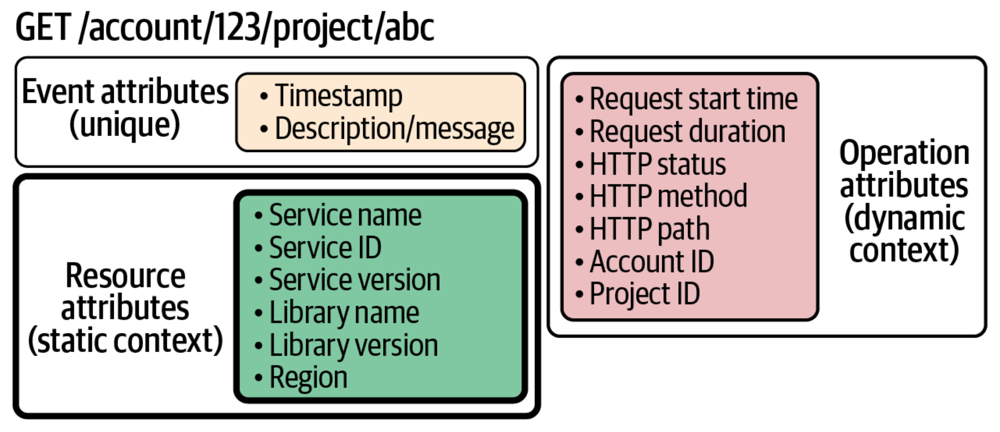
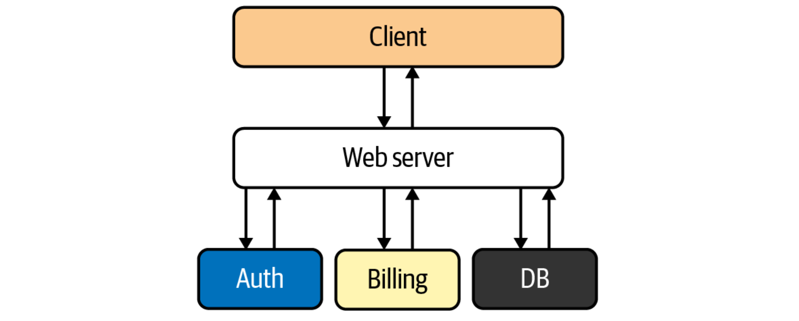

# 第 2 章：结构化数据的价值

眯着眼睛看图表并不是寻找相关性的最佳方式。目前在运维人员头脑中进行的大量工作实际上是可以自动化的。这使运维人员可以在识别问题、提出假设和验证根本原因之间迅速行动。

为了建立更好的工具，我们需要更好的数据。遥测必须具备以下两个要求以支持高质量的自动分析：

- 所有的数据点都必须用适当的索引连接在一个图上。
- 所有代表常见操作的数据点必须有明确的键和值。

在这一章中，我们将从一个基本的构件开始浏览现代遥测数据模型：属性。

## 属性：定义键和值

最基本的数据结构是**属性（attribute）**，定义为一个键和一个值。OpenTelemetry 的每个数据结构都包含一个属性列表。分布式系统的每个组件（HTTP 请求、SQL 客户端、无服务器函数、Kubernetes Pod）在 OpenTelemetry 规范中都被定义为一组特定的属性。这些定义被称为 OpenTelemetry **语义约定**。表 2-1 显示了 HTTP 约定的部分列表。

| 属性             | 类型   | 描述                                                         | 示例            |
| ---------------- | ------ | ------------------------------------------------------------ | --------------- |
| http.method      | string | HTTP 请求类型                                                | GET; POST; HEAD |
| http.target      | string | 在 HTTP 请求行中传递的完整的请求目标或等价物                 | /path/12314/    |
| http.host        | string | HTTP [host header](https://datatracker.ietf.org/doc/html/rfc7230#section-5.4) 的值。当标头为空或不存在时，这个属性应该是相同的。 | www.example.org |
| http.scheme      | string | 识别所使用协议的 URI 方案                                    | http; https     |
| http.status_code | int    | HTTP 请求状态码                                              | 200             |

**表 2-1：HTTP 规范的部分列表**

有了这样一个标准模式，分析工具就可以对它们所监测的系统进行详细的表述，同时进行细微的分析，而在使用定义不明确或不一致的数据时，是不可能做到的。

## 事件：一切的基础

OpenTelemetry 中最基本的对象是**事件（event）**。事件只是一个时间戳和一组属性。使用一组属性而不是简单的消息 / 报文，可以使分析工具正确地索引事件，并使它们可以被搜索到。

有些属性对事件来说是独一无二的。时间戳、消息和异常细节都是特定事件的属性的例子。

然而，大多数属性对单个事件来说**并不**独特。相反，它们是一组事件所共有的。例如，`http.target` 属性与作为 HTTP 请求的一部分而记录的每个事件有关。如果在每个事件上反复记录这些属性，效率会很低。相反，我们把这些属性拉出到围绕事件的封装中，在那里它们可以被写入一次。我们把这些封装称为**上下文（context）**。

有两种类型的上下文：静态和动态（如图 2-1 所示）。**静态上下文**定义了一个事件发生的物理位置。在 OpenTelemetry 中，这些静态属性被称为**资源**。一旦程序启动，这些资源属性的值通常不会改变。

**动态上下文**定义了事件所参与的活动操作。这个操作层面的上下文被称为**跨度（span）**。每次操作执行时，这些属性的值都会改变。

不是所有的事件都有两种类型的上下文。只有资源的自由浮动事件，如程序启动时发出的事件，被称为**日志（log）**。作为分布式事务的一部分而发生的事件被称为**跨度事件（span event）**。

## 资源：观察服务和机器

资源（静态上下文）描述了一个程序正在消费的物理和虚拟信息结构。服务、容器、部署和区域都是资源。图 2-2 显示了一个典型的购物车结账事务中所涉及的资源。

系统运行中的大多数问题都源于资源争夺，许多并发的事务试图在同一时间利用相同的资源。通过将事件放在它们所使用的资源的上下文中，就有可能自动检测出许多类型的资源争夺。

像事件一样，资源可以被定义为一组属性。表 2-2 显示了一个服务资源的例子。

**表 2-2：服务资源的例子**

| 属性                | 类型   | 描述                      | 示例                                  |
| ------------------- | ------ | ------------------------- | ------------------------------------- |
| service.name        | string | 服务的逻辑名称            | shopping cart                         |
| service.instance.id | string | 服务实例的 ID             | 627cc493- f310-47de-96bd-71410b7dec09 |
| service.version     | string | 服务 API 或者实现的版本号 | 2.0.0                                 |

除了识别机器所需的基本信息，配置设置也可以作为资源被记录下来。要访问一台正在运行的机器来了解它是如何配置的，这个负担太让人害怕了。相反，在配置文件中发现的任何重要信息也应该表示为一种资源。

## 跨度：观察事务

跨度（动态上下文）描述计算机操作。跨度有一个操作名称，一个开始时间，一个持续时间，以及一组属性。

标准操作是使用语义约定来描述的，比如上面描述的 HTTP 约定。但也有一些特定的应用属性，如 `ProjectID` 和 `AccountID`，可以由应用开发者添加。

跨度也是我们描述因果关系的方式。为了正确记录整个事务，我们需要知道哪些操作是由其他哪些操作触发的。为了做到这一点，我们需要给跨度增加三个属性：`TraceID`、`SpanID` 和 `ParentID`，如表 2-3 所示。

**表 2-3：跨度的三个额外属性**

| 属性     | 类型        | 描述         | 示例                             |
| -------- | ----------- | ------------ | -------------------------------- |
| traceid  | 16 字节数组 | 识别整个事务 | 4bf92f3577b34da6a3ce929d0e0e4736 |
| spanid   | 8 字节数组  | 识别当前操作 | 00f067aa0ba902b7                 |
| parentid | 8 字节数组  | 识别父操作   | 53ce929d0e0e4736                 |

这三个属性是 OpenTelemetry 的基础。通过添加这些属性，我们所有的事件现在可以被组织成一个图，代表它们的因果关系。这个图现在可以以各种方式进行索引，我们稍后会讨论这个问题。

## 追踪：看似日志，胜过日志

我们现在已经从简单的事件变成了组织成与资源相关的操作图的事件。这种类型的图被称为**追踪（trace）**。图 2-3 显示了一种常见的可视化追踪方式，重点是识别操作的延迟。

从本质上讲，追踪只是用更好的索引来记录日志。当你把适当的上下文添加到适当的结构化的日志中时，可以得到追踪的定义。

想想你花了多少时间和精力通过搜索和过滤来收集这些日志；那是收集数据的时间，而不是分析数据的时间。而且，你要翻阅的日志越多，执行并发事务数量不断增加的机器堆积，就越难收集到真正相关的那一小部分日志。

然而，如果你有一个 TraceID，收集这些日志只是一个简单的查询。通过 TraceID 索引，你的存储工具可以自动为你做这项工作；找到一个日志，你就有了该事务中的所有日志，不需要额外的工作。

既然如此，为什么你还会要那些没有 "追踪"ID 的 "日志"？我们已经习惯了传统的日志管理迫使我们做大量的工作来连接这些点。但这些工作实际上是不必要的；它是我们数据中缺乏结构的副产品。

分布式追踪不仅仅是一个测量延迟的工具；它是一个定义上下文和因果关系的数据结构。它是把所有东西联系在一起的胶水。正如我们将看到的，这种胶水包括最后一个支柱 —— 指标。

## 指标：观察事件的总体情况

现在我们已经确定了什么是事件，让我们来谈谈事件的聚合。在一个活跃的系统中，同样的事件会不断发生，我们以聚合的方式查看它们的属性来寻找模式。属性的值可能出现得太频繁，或者不够频繁，在这种情况下，我们要计算这些值出现的频率。或者该值可能超过某个阈值，在这种情况下，我们想衡量该值是如何随时间变化的。或者我们可能想以直方图的形式来观察数值的分布。

这些聚合事件被称为**度量**。就像普通的事件一样，度量有一组属性和一组语义上的便利条件来描述普通概念。表 2-4 显示了一些系统内存的例子属性。

**表 2-4：系统内存的属性**

| 属性                      | 值类型 | 属性值                    |
| ------------------------- | ------ | ------------------------- |
| system.memory.usage       | int64  | used, free, cached, other |
| system.memory.utilization | double | used, free, cached, other |

## 与事件相关的指标：统一的系统

传统上，我们认为指标是与日志完全分开的。但实际上它们是紧密相连的。例如，假设一个 API 有一个衡量每分钟错误数量的指标。那是一个统计数字。然而，每一个错误都是由一个特定的事务行为产生的，使用特定的资源。这些细节在我们每次递增该计数器时都会出现，我们想知道这些细节。

当运维人员被提醒发现错误突然激增时，他们会想到的第一个问题自然是："是什么导致了这个激增？" 看一下例子的追踪可以回答这个问题。在失败的事务中较早发生的事件（或未能发生的事件）可能是错误的来源。

在 OpenTelemetry 中，当指标事件在跨度的范围内发生时，这些追踪的样本会自动与指标相关联，作为**追踪的范例（trace examplar）**。这意味着不需要猜测或寻找日志。OpenTelemetry 明确地将追踪和度量联系在一起。一个建立在 OpenTelemetry 上的分析工具可以让你从仪表盘上直接看到追踪，只需一次点击。如果有一个模式 —— 例如，一个特定的属性值与导致一个特定错误的追踪密切相关 —— 这个模式可以被自动识别。

## 自动分析和编织

事件、资源、跨度、指标和追踪：这些都被 OpenTelemetry 连接在一个图中，并且它们都被发送到同一个数据库，作为一个整体进行分析。这就是下一代的可观测性工具。

现代可观测性将建立在使用结构的数据上，这些结构允许分析工具在所有类型的事件和总量之间进行关联，这些关联将对我们如何实践可观测性产生深远影响。

向全面观察我们的系统过渡将有许多好处。但我相信，这些新工具提供的主要省时功能将是各种形式的**自动关联检测**。在寻找根本原因时，注意到相关关系可以产生大量的洞察力。如图 2-4 所示，相关性往往是产生根本原因假设的关键因素，然后可以进一步调查。

平均表现是什么样子的？异常值是什么样子的？哪些趋势在一起变化，它们的共同点是什么？相关性可能发生在许多地方：跨度中的属性之间、追踪中的跨度之间、追踪和资源之间、指标内部，以及所有这些地方都有。当所有这些数据被连接到一个图中时，这些相关性就可以被发现了。

这就是为什么统一的数据编织是如此关键。任何自动匹配的分析的价值完全取决于被分析的数据的结构和质量。机器遍历数据的图表；它们不会进行逻辑的飞跃。准确的统计分析需要一个有意设计的遥测系统来支持它。

## 重点：自动分析为您节省时间

为什么我们关心相关性分析的自动化？因为时间和复杂性对我们不利。随着系统规模的扩大，它们最终变得太复杂了，任何操作者都无法完全掌握系统的情况，而且在建立一个假设时，永远没有足够的时间来调查每一个可能的联系。

问题是，选择调查什么需要直觉，而直觉往往需要对组成分布式系统的每个组件有深刻的了解。随着企业系统的增长和工程人员的相应增加，任何一个工程师对每个系统深入了解的部分自然会缩减到整个系统的一小部分。直觉并不能很好地扩展。

直觉也极易被误导；问题经常出现在意想不到的地方。根据定义，可以预见的问题几乎不会经常发生。剩下的就是所有未曾预料到的问题了，这些问题已经超出了我们的直觉。

这就是自动关联检测的作用。有了正确的数据，机器可以更有效地检测出相关的关联。这使得运维人员能够快速行动，反复测试各种假设，直到他们知道足够的信息来制定解决方案。